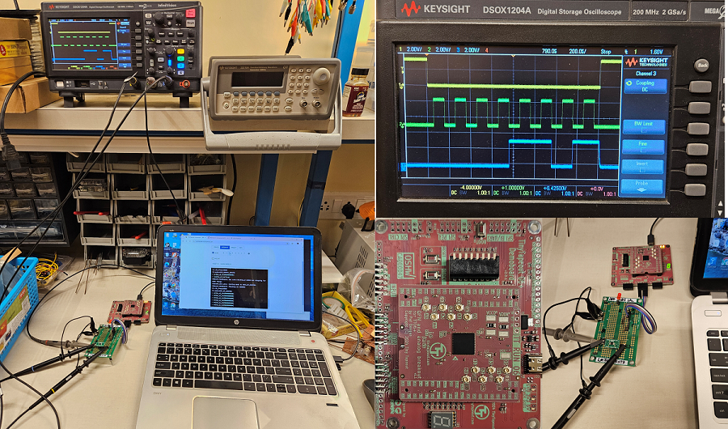
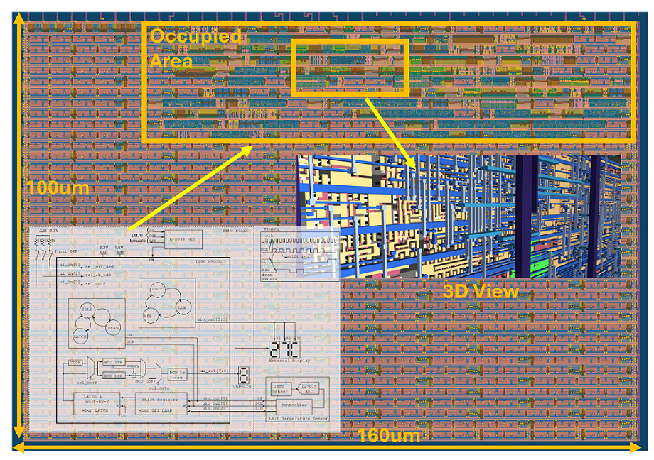

  

# Digital Temperature Monitor in Skywater 130nm CMOS

## Test Setup

- [Demo Video showing a quick functional test after receiving the board](https://youtube.com/shorts/WfNDrHECN1A)

## Layout, GDS Render and Images

# Project Abstract: Digital Temperature Monitor

This project immerses undergraduate students in ASIC design by having them develop an architecture to read temperature sensor data via SPI and display it on a 7-segment display. Using the TinyTapeout platform for low-cost fabrication with the Skywater 130nm CMOS process, students gain experience in ASIC design in the context of electronic system design. A low gate count (209 std cells) design that displays temperature in the range of $0-99^\circ C$ or $0-99^\circ F$ with an accuracy of $\pm 2^\circ C$.

# Project Description

This project offers a straightforward, yet highly effective approach to immersing undergraduate students in ASIC design within the broader context of electronic system design. 

Initially, students examine the datasheet of the temperature sensor ([LM70](docs/datasheet-LM70-TI-tempSensor.pdf) ) to grasp essential electrical features such as Vdd, resolution, accuracy, and the SPI communication timing diagram. Students proceed to develop an architecture that reads temperature data via the SPI protocol and displays it on a 7-segment display. 

To give students a comprehensive tapeout experience, the [TinyTapeout (TT)](https://tinytapeout.com) platform was selected, offering a budget-friendly option to fabricate designs using the Skywater 130nm CMOS process. The TT platform offers a minimum tile size of 100um x 160um with 8 input, 8 output, and 8 bidirectional ports. This setting provides students with hands-on experience in electronic system design, requiring them to manage input and output peripherals within specified constraints. 

Throughout this project, students encounter numerous digital design concepts such as finite-state machines (FSM), employing fixed-point arithmetic to optimize accuracy against hardware resources, using SPI for synchronous serial communication, BCD to-7-segment decoders, and multiplexing multiple displays to reduce the number of output ports. 

In addition, test modes are introduced to simulate real-world product design scenarios. The entire RTL-to-GDS process was executed using open source tools, including Icarus-Verilog and gtkwave for RTL simulation and verification, and OpenLane flow for the back-end, incorporating Yosys for synthesis, OpenSTA for Static Timing Analysis, Magic, and KLayout for physical verification. The TinyTapeout platform further supports learning through a demo board featuring an RP2040 microcontroller, enabling students to automate testing routines with micro-Python, an established industry method in testing and characterization.

## Working Principle

Above figure shows the general block diagram of the complete system. The temperature sensor (Texas Instrument LM70) has a dynamic range of 11 bits with a resolution of $\pm 0.25^\circ C$. In this project, we will only use MSB 8 bits with a resolution of $\pm 2^\circ C$. As shown in the timing diagram in the top right corner of the Figure 1, the LM 70 is configured as an SPI _peripheral_, with communication initiated by choosing the chip (CS) low. While CS is low, the data is clocked out of the sensor every _negative edge_ of the SPI clock (SCK) and the design reads those data at the following _positive edge_. The design provides eight SCK clock pulses, and then the CS is pulled high to stop the communication.

The serial 8-bit data are captured in a shift register, and the data is _latched_ after 8 SCK clock pulses. Before the data are latched, it is multiplied by 2 (left shift by 1). This multiplication captures the fact that the LSB of the data is $2^\circ~C$.

The exact equation to convert temperature in centigrade to Fahrenheit is $T_F = T_C 9/5 + 32$ . To keep the hardware simple, the implemented equation is approximated to $T_F = T_C 2 + 32$. By approximating $9/5$ by $2$, the hardware is simply a left shift by 1. But this approximation results in an error in the output that is a function of temperature: $0.62\%$ error at $0^\circ C$ and $9.43\%$ error at $100^\circ C$. Based on the input `ui_in[2]`, a MUX selects the temperature in Celsius or Fahrenheit. 

The data are then converted to binary coded decimal (BCD) decimal for the two temperature digits to be displayed. The BCD data are then converted to 8-bit 7-segment display format to drive an external display. To save output pins, the 7-segment for all three displays are connected to the ports `uo_out[7:0]` and the displays are _time multiplexed_ using the select lines `uio_out[5:3]`. If the displays are switched fast enough (but not too fast), all three displays appear steady without any appearance of flicker.

Since the demo PCB board has one 7-segment display, a provision in the design is made for test purpose where the temperature can be displayed on the onboard display, LSB and MSB one at a time. Kindly refer to the aforementioned 'Mode of Operation' table for further elucidation.

# Test and Characterization

**MODES OF OPERATION**

| MODE | `ui_in[0]` | `ui_in[1]` | `ui_in[2]` | DESCRIPTION |
|-|-|-|-|-|
| 1 | `1` | `X` | `0` | External Display in deg-C |
| 2 | `1` | `X` | `1` | External Display in deg-F |
| 3 | `0` | `0` | `0` | MSB Onboard Display in deg-C |
| 4 | `0` | `1` | `0` | LSB Onboard Display in deg-C |
| 5 | `0` | `0` | `1` | MSB Onboard Display in deg-F |
| 6 | `0` | `1` | `1` | LSB Onboard Display in deg-F |

This project is designed with testability in mind so it can be tested with barebone PCB without any external hardware. The table below suggests different test modes for testing the design without any external hardware.

| TestNo. | Mode | uio_in[2] | Ext. H/W | RP2040 | 7-seg Ouput |
|-|-|-|-|-|-|
| 1 | 3 | `0` | None | clk~10kHz | `0` |
| 2 | 4 | `0` | None | clk~10kHz | `0` |
| 3 | 3 | `SIO` from RP2040 | None | clk~10kHz and SIO | MSB of data sent by RP2040 |
| 4 | 4 | `SIO` from RP2040 | None | clk~10kHz and SIO | LSB of data sent by RP2040 |

For the first two tests, the `uio_in[2]` port is grounded and a clock frequency of approximately 10 kHz is provided to the design from the RP2040 as shown in the figure. And when the inputs (`ui_in[2:0]`) are configure in Mode `3` or `4`, the single 7-segment display should display `0` in both modes.

Test 3 and 4 in the table above will use the RP2040 as a SPI peripheral and micro-python code will be written to emulate the temperature sensor LM70. This will allow us to test the entire design without connecting the external temperature sensor or display.

# Acknowledgement 

Thanks to [Priyansu Sahoo](https://github.com/Priyansu122) for the [Tiny Tapeout](https://tinytapeout.com/) conversion of this project, [Silicon University](https://www.silicon.ac.in) for financial and infrastructure support, and previous students for their efforts to bring this project to a tapeout state.

#  About Tiny Tapeout

TinyTapeout is an educational project that aims to make it easier and cheaper than ever to get your digital designs manufactured on a real chip.

To learn more and get started, visit https://tinytapeout.com.

## Verilog Projects

1. Add your Verilog files to the `src` folder.
2. Edit the [info.yaml](info.yaml) and update information about your project, paying special attention to the `source_files` and `top_module` properties. If you are upgrading an existing Tiny Tapeout project, check out our [online info.yaml migration tool](https://tinytapeout.github.io/tt-yaml-upgrade-tool/).
3. Edit [docs/info.md](docs/info.md) and add a description of your project.
4. Optionally, add a testbench to the `test` folder. See [test/README.md](test/README.md) for more information.

The GitHub action will automatically build the ASIC files using [OpenLane](https://www.zerotoasiccourse.com/terminology/openlane/).

## Enable GitHub actions to build the results page

- [Enabling GitHub Pages](https://tinytapeout.com/faq/#my-github-action-is-failing-on-the-pages-part)

## Resources

- [FAQ](https://tinytapeout.com/faq/)
- [Digital design lessons](https://tinytapeout.com/digital_design/)
- [Learn how semiconductors work](https://tinytapeout.com/siliwiz/)
- [Join the community](https://tinytapeout.com/discord)
- [Build your design locally](https://docs.google.com/document/d/1aUUZ1jthRpg4QURIIyzlOaPWlmQzr-jBn3wZipVUPt4)

## What next?

- [Submit your design to the next shuttle](https://app.tinytapeout.com/).
- Edit [this README](README.md) and explain your design, how it works, and how to test it.
- Share your project on your social network of choice:
  - LinkedIn [#tinytapeout](https://www.linkedin.com/search/results/content/?keywords=%23tinytapeout) [@TinyTapeout](https://www.linkedin.com/company/100708654/)
  - Mastodon [#tinytapeout](https://chaos.social/tags/tinytapeout) [@matthewvenn](https://chaos.social/@matthewvenn)
  - X (formerly Twitter) [#tinytapeout](https://twitter.com/hashtag/tinytapeout) [@matthewvenn](https://twitter.com/matthewvenn)

# Helpful Info
- [Discord link clarifying I/O](https://discordapp.com/channels/1009193568256135208/1212524847708774460)
- ena pin is an option for user to use, not mandotary. [See doscord link](https://discordapp.com/channels/1009193568256135208/1212524847708774460)
- Don't need `wokiid`, just follow the `tt-06 template`
- PCB clock speed (6Hz - 66MHz) [See clock specs here](https://tinytapeout.com/specs/clock/)
- Shipping to India is fine.
- Boards are tested for functionality before shipping.

# Resources
- [Payment App](https://app.tinytapeout.com/prepurchase) [ [Discord Ref](https://discordapp.com/channels/1009193568256135208/1009193568256135211/1222255345230151841) ]
- [How to locally harden (rtl2gds) your design](https://docs.google.com/document/d/1aUUZ1jthRpg4QURIIyzlOaPWlmQzr-jBn3wZipVUPt4/edit#heading=h.wwc5ldl01nl5)
- [A good reference for doc](https://github.com/scorbetta/tt06-scorbetta-goa/blob/main/docs/info.md)

# Tasks

